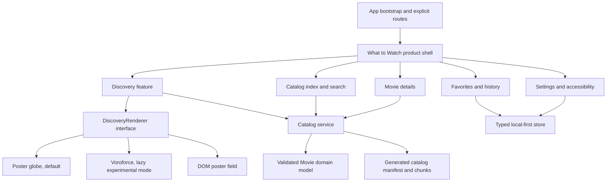

# What to Watch: Project Blueprint

Second-pass audit date: 2026-07-10  
Repository state reviewed: `main` at `a05fbf1` (`Add ScrollFlix WebGL fallback`)  
Purpose: one build-ready source of truth for product scope, current implementation, architecture, risks, MVP acceptance criteria, and next actions.

## Executive decision

What to Watch should be a fast, visual decision tool for the moment when someone wants a movie but does not know which one. It should not become another general-purpose movie database.

The recommended product direction is:

1. Make the newer poster globe, movie index, genre view, and editorial detail experience the canonical product shell at `/`.
2. Rename all live surfaces to **What to Watch**. Treat `ScrollFlix` as a prototype name and remove it from public metadata and UI.
3. Bring the proven local-first capabilities from the older Voroforce app into that shell: favorites, settings, custom links, persistence, device profiles, and diagnostics.
4. Put the globe renderer and the older Voroforce renderer behind one typed `DiscoveryRenderer` boundary. Ship only one by default and lazy-load the other as an experimental or classic mode until profiling gives a final engine decision.
5. Keep MVP backend-free. Use validated static catalog data plus local storage. Add server-side capabilities only when accounts, sync, or trustworthy regional provider availability are actually being built.

The immediate job is consolidation, not feature expansion. The repository currently contains most of the desired ideas, but they are split between two products that do not share a coherent route, domain model, state layer, or test story.

## Product promise

### One-sentence pitch

What to Watch turns indecision into exploration: browse a tactile field of movies, narrow it by mood or practical constraints, understand a promising title, and leave with a concrete next action.

### Target user

The primary user:

- Wants to watch a movie now or tonight.
- Does not have a title in mind.
- Finds streaming-service rows repetitive or overwhelming.
- Values discovery and serendipity more than a supposedly perfect recommendation.
- Needs a low-pressure path from browsing to choosing.

### Core job to be done

> When I want to watch something but feel stuck, help me move from vague intent to one promising movie without making me search a database or answer a long questionnaire.

### Product principles

- **Decision first:** every screen should help the user notice, narrow, inspect, save, or act on a movie.
- **Visual, not opaque:** the spatial experience is the differentiator, but a list and text search must always remain available.
- **Honest claims:** show the catalog actually loaded, label heuristic moods as such, and never imply provider availability that has not been verified.
- **Local-first by default:** favorites and preferences should work without an account.
- **Graceful by design:** WebGL is enhancement, not a gate. The fallback should be a complete discovery experience.
- **Fast enough to invite play:** loading hundreds of posters cannot block the first meaningful interaction.
- **Movie-led MVP:** series support is a later product decision, not a disabled promise occupying MVP controls.

## Reverified current state

### What is live at the root route

`app/main.tsx` sends `/` and the former `/test` route to `TestGalleryApp`. This is the current public product surface.

It includes:

- A custom WebGL2 poster globe with arcball-style interaction.
- A non-WebGL poster fallback.
- Gallery, movie index, and genre modes.
- Title search.
- Genre, runtime, mood, and content-type controls.
- Random movie selection.
- Compact and expanded movie details.
- Similar-movie suggestions.
- An about drawer.
- A watch-links dialog whose provider actions are currently disabled.

### What remains in the older app

Arbitrary non-root paths mount the older React and Voroforce application. That side contains valuable, more mature infrastructure:

- Zustand slices and selectors.
- Versioned local settings migration.
- Favorites with saved canvas positions.
- Custom external link types.
- TMDB and IMDb outbound links.
- Render presets, cell limits, device detection, and fullscreen controls.
- Intro, settings, about, favorites, keyboard help, and performance HUD surfaces.
- The custom Voroforce simulation and rendering engine.

This code is not merely legacy. It is the source of several MVP capabilities missing from the root experience. However, its routing is implicit and its UI is no longer the canonical product.

### Catalog facts

The checked-in catalog is five JSON files with 216 records each:

| Fact | Verified value |
| --- | ---: |
| Catalog records | 1,080 |
| Unique movie IDs | 1,080 |
| Duplicate ID rows | 0 |
| Release-year range | 1971-2021 |
| Missing or zero runtime | 152 |
| Missing overview | 22 |
| Missing IMDb ID | 1 |
| Missing genres | 34 |
| Zero or missing rating | 5 |
| Checked-in media files | 228 |
| Checked-in media size | about 13 MB |

The data is heavily concentrated in a few years: 2010 has 227 titles, 2014 has 173, 2012 has 135, 2016 has 132, and 2015 has 128. This is a curated or partial slice, not a balanced 57,294-title catalog.

The root UI currently says `57,294 movies in index`, while the filter panel correctly reports `1,080 matches`. That contradiction must be removed before public release.

### Code and bundle shape

- `TestGalleryApp` is roughly 2,000 lines in one TSX module.
- Its custom `InfiniteMovieMenu` WebGL engine is roughly 1,500 lines.
- The shared stylesheet is roughly 3,000 lines and contains both product systems.
- The root entry statically imports the newer experience, the older app shell, and Voroforce, so code for both products is available to the same initial bundle graph.
- The fresh production build emitted a 900.11 kB minified main JavaScript chunk, 267.23 kB gzip, and triggered Vite's chunk-size warning.

### Current repository verification

The second pass ran against the current checkout using the bundled Node runtime:

The branch head was `a05fbf1`, but the working tree was not clean. At finalization it contained uncommitted edits in `app/cmps/views/test-gallery/infinite-movie-menu.tsx`, `app/cmps/views/test-gallery/test-gallery.tsx`, `app/cmps/views/test-gallery/test-gallery.test.ts`, and `app/styles.css`. Those edits were preserved. This blueprint describes the live working tree inspected during the audit, not only the last commit.

| Check | Result | Evidence |
| --- | --- | --- |
| TypeScript project build | Pass | `tsc -b --pretty false` exited 0 |
| Biome | Pass | 240 files checked, no fixes |
| Vite production build | Pass with warning | 2,023 modules transformed; 900.11 kB main chunk |
| Unit tests | Fail | 77 passed, 12 failed, 89 total |
| Browser page identity | Pass with naming defect | `/` loaded with title `ScrollFlix` |
| Meaningful first screen | Pass | Gallery content and controls rendered |
| Initial console health | Pass | No warning or error entries in the smoke check |
| Filter interaction | Pass | Drama changed 1,080 matches to 447 |
| Search interaction | Pass | `Blade Runner` returned two titles |
| Detail interaction | Pass | Expanded details and similar movies rendered |
| Mobile verification | Inconclusive | Initial narrow layout rendered, but reload/inspection became unresponsive during poster-atlas loading |
| Existing Playwright suite | Not accepted as evidence | Tests target the old Voroforce container and mostly assert stability rather than outcomes |

The 12 unit-test failures are all in `app/cmps/ui/button.test.tsx`: one old class assertion, ten stale snapshots, and one stale `buttonVariants` class assertion after the Button styling changed. This should be fixed deliberately, not hidden by blindly updating snapshots.

## What the live browser audit revealed

### Confirmed strengths

- The first screen has a distinctive visual identity.
- The core navigation is understandable without an onboarding page.
- Gallery, index, and filter controls expose useful accessible names.
- Genre filtering gives immediate, comprehensible feedback.
- Search works and retains the surrounding product navigation.
- Movie details have a strong editorial hierarchy.
- Similar movies keep the user inside the discovery loop.
- The application has a meaningful generated-poster fallback.

### Confirmed product gaps

- The root product has no favorites or watchlist.
- The root product does not use the persistent settings architecture.
- The root product has no custom links.
- Netflix, Prime Video, Apple TV, and YouTube actions are displayed but disabled.
- No real next action is available from the new detail card.
- `All` and `Movies` are effectively the same because the catalog contains movies only.
- Series controls consume interface space even though every series option is disabled.
- The UI mixes `ScrollFlix` and `What to Watch` in the same viewport.
- The Lagos time and location are hard-coded brand decoration, not user location or a movie-decision feature.
- Movie details have no shareable URL, so reload, sharing, history, and deep linking cannot preserve the selected title.

## Important blind spots and risks

### P0: split product and routing

The app has two public experiences selected by pathname instead of an explicit router or feature flag. `/` mounts the new gallery; arbitrary non-root paths mount the old app. `/test` is silently rewritten to `/`.

Consequences:

- There is no documented canonical route for the old app.
- Shared-link and custom-link behavior depends on which pathname created the URL.
- Product behavior can change because of an otherwise meaningless path.
- Both experiences remain coupled at the entry point.
- README and Phase 2 screenshots describe a different primary UI from the one users see at `/`.

Required improvement: introduce explicit route ownership and make one product canonical.

### P0: the core action is unfinished

The product promises to help someone choose what to watch, but the new root flow ends at disabled provider buttons. Real Netflix or regional-provider availability is a data product, not a static button label.

MVP solution:

- Provide honest, working links to TMDB and IMDb.
- Support user-defined search links, reusing the older custom-link model.
- Optionally add a generic web or JustWatch search URL if licensing and link behavior are approved.
- Do not label a provider as available unless availability is region-specific and sourced.

### P0: catalog count and metadata are misleading

`INDEX_CATALOG_COUNT = 57294` is presentation copy, not loaded data. The UI must derive counts from the validated manifest or current result set.

The current catalog also has missing runtime, overview, genre, IMDb, and rating fields. The UI handles some missing states, but ingestion does not validate or report them.

Required improvement: generate a catalog manifest with record count, schema version, generated date, source attribution, and quality statistics.

### P0: poster-atlas loading architecture

The root globe displays up to 1,000 items. On mount it:

- Starts an image load for every item.
- Builds a square atlas with cells up to 192 pixels.
- Can allocate a 6,144 x 6,144 RGBA atlas for 1,000 items, about 144 MiB before mipmaps or browser overhead.
- Calls full `texImage2D` atlas uploads repeatedly as images settle, potentially once per animation frame during the loading burst.
- Uses per-image timeouts of up to 6.5 seconds plus a 4.5-second fallback path.

The browser audit became sluggish and timed out during reload/inspection while this work was active. That is not a formal profile, but it is consistent with the code path and makes this a pre-MVP performance investigation.

Required improvement:

- Load only the first useful poster set initially, for example 48-96 items.
- Queue remaining poster loads with bounded concurrency.
- Use `texSubImage2D` for individual atlas cells or page the atlas into smaller textures.
- Cap atlas dimensions and memory per quality profile.
- Cancel stale requests when filters or modes change.
- Record time to first interactive poster, requests started, atlas bytes, frame time, and failure count.

### P0: tests do not cover the live product

The existing Playwright tests primarily check `#voroforce`, press speculative shortcuts, and accept the absence of expected modal behavior. They can pass without proving the root gallery, filter, search, details, watch action, persistence, or fallback works.

Required improvement: replace them with outcome-based tests for the canonical root flow.

### P1: duplicated domain and recommendation logic

The new app defines `RawMovie` and `TestMovie` and its own mapping, filters, mood rules, and similar-movie logic. The older app defines `Film`, batch loading, discovery tags, and a separate similarity score.

Consequences:

- Different screens can disagree on title metadata and recommendations.
- Data quality fixes must be implemented twice.
- Favorites and custom links cannot be added cleanly to the new app.

Required improvement: one validated `Movie` domain model and one catalog service used by every renderer and UI surface.

### P1: state mutation in the older product

Some older settings and favorite actions mutate `userConfig` in place before passing the same object back to the store. Persistence may update while selectors that rely on reference equality fail to re-render consistently.

Required improvement: immutable update helpers and typed library/settings actions.

### P1: accessibility is incomplete

The new shell has many good labels, but its custom dialogs are not built on the existing Radix primitives and do not visibly implement focus trapping, background inertness, or focus restoration. The WebGL globe depends on a single active-item proxy rather than making all visual items keyboard-addressable.

Required improvement:

- Use the shared Dialog/Drawer primitives or implement equivalent focus behavior.
- Ensure Escape, initial focus, focus return, and background inertness.
- Keep list mode as a complete keyboard and screen-reader alternative.
- Respect reduced motion in globe movement, transitions, fallback animation, and scrolling.
- Verify 200% zoom, contrast, touch target size, and high-contrast mode.

### P1: international catalog handling

Alphabetical mode deliberately removes titles that do not start with Latin letters, including non-Latin titles and titles such as `[Rec]`. Those movies remain in year mode but silently disappear from the alphabetical index.

Required improvement: group all Unicode titles using `Intl.Collator`, with a `#` group for symbols, instead of excluding them.

### P1: deployment configuration is split across hosts

The repository contains:

- `vercel.json` for Vercel.
- `public/_headers`, commonly consumed by other static hosts.
- `functions/_middleware.js`, shaped like Cloudflare Pages middleware.

`vercel.json` does not declare the COOP/COEP headers, so the presence of the other files is not proof those headers are applied on Vercel. Its `buildCommand` is `vite build`, which skips the TypeScript build used by `npm run build`. Its install command also opts out of the committed package lock.

Required improvement:

- Choose and document one deployment target.
- Run the same typecheck and build in local, CI, and hosting environments.
- Use the lockfile reproducibly.
- Configure and verify headers on the chosen host.
- Resolve the tension between `COEP: require-corp` and remote TMDB/Google assets before enforcing it.

### P1: SEO and release metadata are placeholders

- The page title, Open Graph data, Twitter data, and mobile title say `ScrollFlix`.
- Canonical and social URLs use `https://what-to-watch.example/`.
- The sitemap uses the same placeholder domain and an old fixed date.
- The README says the public landing page is coming soon while the app itself is the root experience.
- Mobile-web-app metadata is present without a manifest or offline application behavior.

Required improvement: generate metadata from one product configuration and use the real deployment URL.

### P2: mood filters need honest semantics

Current moods are deterministic genre/rating heuristics. They can be useful, but labels such as `Funny`, `Dark`, and `Fast` imply editorial understanding the dataset may not support.

Required improvement: document the scoring rules, expose a short reason when useful, and later generate explicit mood metadata in the data-prep pipeline.

### P2: operational and legal readiness

- There is no CI workflow.
- There is no automated dependency or release security check.
- Telemetry is opt-in but needs a concise public privacy statement before release.
- Data, poster, font, shader, and generated-media attribution needs a release review.
- Google Fonts and TMDB imagery complicate strict CSP and cross-origin isolation.

## MVP specification

### MVP user journey

1. The user opens What to Watch and sees useful movie choices quickly.
2. They move through the visual gallery or switch to the index.
3. They narrow choices by search, genre, runtime, or a clearly defined mood.
4. They inspect a movie with reliable core metadata and similar alternatives.
5. They save it or open a real follow-up link.
6. Their favorites and preferences remain after reload.
7. The same journey works without WebGL and on a narrow mobile viewport.

### MVP feature checklist

#### Product and navigation

- [ ] One canonical `/` experience named What to Watch.
- [ ] Explicit routes or URL state for discovery and a selected movie.
- [ ] No arbitrary-path switch to another product.
- [ ] Gallery, index, and genre views remain available.
- [ ] No disabled series/provider promises in the primary UI.
- [ ] Honest loaded-catalog and filtered-result counts.

#### Discovery

- [x] Visual poster discovery concept.
- [x] Text index and title search.
- [x] Genre, runtime, and heuristic mood filtering.
- [x] Random movie action.
- [ ] Filters derived from validated catalog metadata.
- [ ] Unicode-safe alphabetical grouping.
- [ ] Empty, error, and retry states for every data surface.
- [ ] URL or session restoration for the active view and selected movie.

#### Movie details and action

- [x] Compact and expanded details.
- [x] Similar-movie suggestions.
- [ ] One shared similarity/scoring implementation.
- [ ] Working TMDB and IMDb links.
- [ ] Reusable custom link types.
- [ ] Add/remove favorite action in the canonical detail surface.
- [ ] Clear handling for missing runtime, overview, genres, rating, and IDs.
- [ ] No unverified provider-availability claims.

#### Personal library and settings

- [ ] Favorites persisted locally.
- [ ] Favorites view with open, remove, clear, and revisit actions.
- [ ] Persist only stable preferences and library data.
- [ ] Immutable store actions and versioned migrations.
- [ ] Quality profile: low, balanced, high.
- [ ] Reduced-motion preference respected.
- [ ] Clear local-data reset action.

#### Performance and resilience

- [x] WebGL failure fallback exists.
- [ ] Fallback provides the full core decision journey.
- [ ] Bounded poster-load concurrency and cancellation.
- [ ] No repeated full-atlas uploads while individual posters load.
- [ ] Renderer cleanup verified on view changes and unmount.
- [ ] Initial JavaScript route is code-split from the non-default renderer and dev tools.
- [ ] No main production chunk above the agreed budget.
- [ ] Loading progress reflects useful readiness, not only request completion.

#### Accessibility and responsive behavior

- [ ] Complete keyboard journey: browse/index, filter, open, save, follow link, close.
- [ ] Modal focus trap, initial focus, Escape, focus return, and inert background.
- [ ] Screen-reader-friendly list alternative.
- [ ] Desktop, tablet, and narrow mobile layouts verified.
- [ ] 200% zoom and long-title overflow verified.
- [ ] Reduced motion and high-contrast behavior verified.

#### Quality and release

- [x] TypeScript currently passes.
- [x] Biome currently passes.
- [x] Production build currently completes.
- [ ] All unit tests pass with intentional Button expectations.
- [ ] Root-product component tests cover loading, error, filters, details, and favorites.
- [ ] Playwright covers the actual canonical user journey.
- [ ] CI runs install, Biome, typecheck, unit tests, build, and core E2E.
- [ ] Real deployment URL, metadata, sitemap, headers, and attribution verified.

### MVP acceptance targets

These are proposed release gates and should be measured on a mid-range Windows laptop and a representative mobile device:

- Meaningful shell visible within 1 second on warm local assets and 2.5 seconds on a normal cold connection.
- First useful poster interaction before the full catalog finishes loading.
- No more than 96 poster requests started for the first visual batch.
- No unbounded image-request fan-out.
- No texture allocation above the selected quality-profile budget.
- Desktop interaction target: 50+ FPS during normal browsing, with no sustained long tasks above 100 ms.
- Mobile interaction target: stable 30+ FPS with a useful non-WebGL path when the budget cannot be met.
- Initial route JavaScript target: under 250 kB gzip, excluding a lazy-loaded experimental renderer.
- Zero uncaught console errors in the core journey.
- Zero critical or serious automated accessibility violations on non-canvas surfaces.
- All release checks green in CI.

## Full desired product specification

### Core surfaces

1. Discovery globe or visual field.
2. Movie index with search, grouping, and sort.
3. Genre and collection exploration.
4. Focused title preview.
5. Movie detail drawer or dialog.
6. Similar-movie trail.
7. Decision filters and active-filter summary.
8. Favorites and recently viewed titles.
9. Custom external-link manager.
10. Settings and quality profile.
11. About, controls, accessibility, and privacy information.
12. Optional performance diagnostics outside the normal consumer UI.

### Future discovery capabilities

- Better mood and vibe metadata: comfort watch, slow burn, high energy, visually striking, hidden gem, familiar favorite.
- Weighted sorting by rating confidence, popularity, release year, runtime, and novelty.
- `More like this` with transparent reasons.
- Exclude genres, years, runtimes, languages, or already-seen titles.
- Shortlist comparison for two to four movies.
- A decision mode that deliberately returns a small set, not another infinite catalog.
- Discovery history and undo.
- Shareable filters, shortlists, and movie URLs.

### Future personal features

- Seen, interested, favorite, and not-for-me states.
- Notes or lightweight tags.
- Import/export of local library data.
- Optional account sync across devices.
- Optional household or group shortlist.

### Series support

Series should be added only after its domain model exists. It needs seasons, episode runtime, status, episode count, and separate similarity/filter behavior. Do not represent it as a disabled movie filter indefinitely.

### Provider availability

There are two valid product levels:

1. **MVP outbound links:** TMDB, IMDb, custom search links, and possibly a generic provider-search destination. No availability claim.
2. **Later availability product:** region-aware provider data with source, freshness timestamp, deep link where permitted, and a clear distinction between subscription, free, rent, and buy.

Provider level 2 requires a maintained data source and likely a server-side or generated-data pipeline. It should not be faked in static UI.

## Recommended frontend architecture



### Suggested module ownership

```text
app/
  bootstrap/             app startup, explicit route parsing, providers
  domain/movie/          Movie schema, types, normalization, scoring
  data/catalog/          manifest, chunk loader, cache, retry, cancellation
  features/discovery/    gallery state and renderer-neutral interactions
  features/index/        search, grouping, sort, virtualized list
  features/details/      details, similar movies, outbound actions
  features/library/      favorites, history, import/export
  features/settings/     preferences, quality, reduced motion
  renderers/globe/       current InfiniteMovieMenu engine
  renderers/voroforce/   adapter around app/vf and voroforce
  renderers/fallback/    full DOM discovery experience
  store/                 typed slices, migrations, immutable actions
  ui/                    shared primitives only
```

### Renderer contract

The React product should depend on a small interface, not engine internals:

```ts
type DiscoveryRenderer = {
  mount(container: HTMLElement, options: RendererOptions): Promise<void>
  setMovies(movies: MovieSummary[]): void
  setActiveMovie(movieId: MovieId | null): void
  focusMovie(movieId: MovieId): void
  reset(): void
  subscribe(listener: RendererEventListener): () => void
  getDiagnostics(): RendererDiagnostics
  dispose(): void
}
```

The exact API can change during implementation, but it must isolate React from buffers, cells, workers, uniforms, and texture internals.

### Catalog contract

At build or data-prep time, generate:

- `catalog-manifest.json`: schema version, record count, generated time, year bounds, genre list, source, attribution, and chunk list.
- Validated movie chunks sized by bytes and expected parse cost, not a magic record count.
- Optional compact search/filter index.
- Data-quality report that fails generation on duplicate IDs or invalid required fields.

At runtime:

- Load the manifest first.
- Load the first useful chunk.
- Validate untrusted JSON at the boundary with Valibot.
- Cache successful chunks.
- Retry only retryable failures.
- Cancel obsolete loads when filters or renderers change.
- Return typed errors that the UI can explain.

## Backend outlook

### MVP: no application backend

The current product does not need accounts, a database, or a custom API to prove its value.

Use:

- Static hosting for the Vite output.
- Generated and validated static catalog assets.
- A CDN or chosen host's asset cache.
- Local storage for settings and favorites.
- Optional opt-in error telemetry with no personal movie history by default.

This keeps cost, privacy risk, and operational burden low while the discovery loop is still being proven.

### Data pipeline: the first backend-like investment

The first server-side work should be an offline data-prep pipeline, not a user database. It should ingest the licensed source, normalize fields, validate records, generate chunks and indexes, optimize image references, and emit attribution and quality reports.

### Backend triggers

Introduce server-side infrastructure only when one of these becomes a committed feature:

- Account authentication and cross-device sync.
- Regional provider availability that must be refreshed.
- Shared shortlists or collaborative sessions.
- Private notes or user-generated data requiring durable storage.
- Server-protected third-party credentials.
- Personalized ranking that cannot remain on-device.

### Possible later services

- Authentication and profile service.
- Favorites/history sync API.
- Provider-data refresh job and regional cache.
- Shareable shortlist service.
- Privacy-controlled analytics pipeline.

No provider secret should be embedded in the Vite client.

## Build plan

### Wave 0: restore a trustworthy baseline

Goal: every future change starts from green, relevant checks.

- [ ] Review the shared Button changes.
- [ ] Update intentional class assertions and snapshots.
- [ ] Get all 89 unit tests green.
- [ ] Add a root-route smoke component test.
- [ ] Replace the weakest Playwright assertions with one canonical discovery flow.
- [ ] Add CI using the same commands as local development.
- [ ] Make Vercel or the chosen host run `npm run build`, not raw `vite build`.

Exit: typecheck, Biome, unit, build, and one real root E2E flow pass locally and in CI.

### Wave 1: canonicalize the product

Goal: one name, one route model, one public experience.

- [ ] Rename ScrollFlix metadata and UI to What to Watch.
- [ ] Replace the placeholder canonical domain and sitemap values.
- [ ] Remove the magic 57,294 count.
- [ ] Introduce explicit routes or URL-state parsing.
- [ ] Move the old experience behind a named development flag or route.
- [ ] Dynamic-import the non-default renderer and dev tools.
- [ ] Remove disabled series controls from MVP UI.
- [ ] Decide whether Lagos/WAT is brand identity; otherwise remove it.

Exit: `/` is unambiguous, shareable, honestly branded, and does not load both engines eagerly.

### Wave 2: unify data and state

Goal: one movie model and one source of product truth.

- [ ] Define the Valibot `Movie` schema.
- [ ] Generate and consume a catalog manifest.
- [ ] Replace `Film` and `TestMovie` boundary duplication with adapters to one model.
- [ ] Centralize search, filters, mood scoring, and similarity.
- [ ] Add immutable favorites and settings actions.
- [ ] Reuse the existing settings migration where valid.
- [ ] Add catalog quality tests for the known missing fields.
- [ ] Fix Unicode alphabetical grouping.

Exit: every feature reads the same validated movie and library contracts.

### Wave 3: complete the decision loop

Goal: the user can leave the app with a movie or save it.

- [ ] Add working TMDB and IMDb actions to the canonical details.
- [ ] Bring in favorites and the favorites view.
- [ ] Bring in custom link types.
- [ ] Add recently viewed titles.
- [ ] Add selected-movie URL state.
- [ ] Improve missing-metadata presentation.
- [ ] Make similar-movie reasons consistent.
- [ ] Replace fake provider buttons with honest outbound actions.

Exit: browse, narrow, inspect, save, revisit, and follow-up all work after reload.

### Wave 4: make rendering release-safe

Goal: preserve the visual idea without making it a reliability risk.

- [ ] Add poster request queueing, cancellation, and priority.
- [ ] Replace repeated full atlas uploads.
- [ ] Set atlas and GPU-memory budgets per quality profile.
- [ ] Instrument load and frame diagnostics.
- [ ] Verify context loss, restore, and disposal.
- [ ] Verify the DOM fallback through the full user journey.
- [ ] Benchmark globe versus Voroforce on the same catalog and devices.
- [ ] Keep one default renderer based on product clarity and measured performance.

Exit: desktop and mobile budgets pass, and WebGL failure does not remove product capability.

### Wave 5: accessibility and release readiness

Goal: a defensible public MVP.

- [ ] Move custom modal behavior onto accessible primitives.
- [ ] Verify keyboard, screen reader, reduced motion, zoom, and contrast.
- [ ] Verify responsive desktop, tablet, and mobile screenshots.
- [ ] Configure host-specific headers and cache policy.
- [ ] Add CSP after asset-hosting decisions are final.
- [ ] Self-host the font or document the remote-font policy.
- [ ] Complete attribution, privacy, and telemetry documentation.
- [ ] Run dependency, secret, and release checks.
- [ ] Publish and smoke-test the real production URL.

Exit: all MVP acceptance targets and release checks pass on the deployed app.

## First build tickets

Start with these in order:

1. **Baseline green:** resolve the 12 Button test failures and add a root smoke test.
2. **Canonical identity:** rename the live app and metadata to What to Watch; derive the count from loaded data.
3. **Route split removal:** explicit canonical route plus lazy experimental Voroforce route.
4. **Domain schema:** create validated `Movie`, `CatalogManifest`, and load-error contracts.
5. **Poster loader:** cap the first gallery batch and add bounded image concurrency.
6. **Atlas update:** use cell-level texture updates or paged atlases.
7. **Real action:** add TMDB/IMDb/custom links; remove disabled provider buttons.
8. **Local library:** integrate immutable favorites into the canonical detail and navigation.
9. **Relevant E2E:** gallery -> filter -> details -> favorite -> reload -> revisit.
10. **Mobile and fallback:** complete the same journey at a narrow viewport with WebGL disabled.

## Decisions to record as ADRs

- Canonical renderer and why.
- Why WebGL remains progressive enhancement.
- Static/local-first MVP versus account backend.
- Catalog source, license, refresh cadence, and quality policy.
- Provider-link level: outbound search versus verified availability.
- Deployment host and cross-origin isolation strategy.
- Product brand: What to Watch, with ScrollFlix retired or explicitly scoped.

## Definition of MVP done

MVP is done when a new user can open the deployed What to Watch URL on desktop or mobile, browse or search the real loaded catalog, narrow it, open a movie, save it, revisit it after reload, and follow a working external action. The experience must remain useful without WebGL, make no false catalog or provider claims, and pass the agreed typecheck, lint, unit, E2E, accessibility, performance, and deployment checks.

Anything beyond that, including accounts, synced history, verified streaming availability, collaborative shortlists, and series, belongs to the post-MVP roadmap unless a new product decision explicitly moves it forward.
